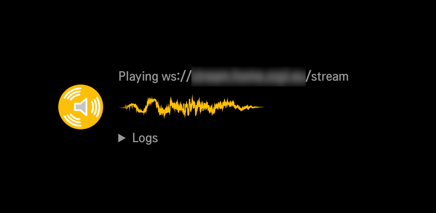

# lgsnapclient

A lightweight [LG webOS app](http://webostv.developer.lge.com/) to play back
a low-latency [Snapcast](https://github.com/badaix/snapcast/) Websocket stream
using Javascript AudioContext.

## License

GPL-3.0, see [LICENSE](./LICENSE).

The icons, `snapstream.js` and `libflac.js` files are verbatim copies or slight
adaptations of upstream
[Snapserver web](https://github.com/badaix/snapcast/tree/master/server/etc/snapweb)
licensed under GPL-3.0.

## Building

Note the stream WS URL is hard-coded in [index.html](src/index.html#:~:text=changeme).
Update it before packaging and installing the app.

During development, use the very quick, non-minifying Python packager:

    $ ./package.py

For "production" builds, you can rely on the official
[`ares-package`](http://webostv.developer.lge.com/sdk/tools/using-webos-tv-cli/?wos_flag=ares-package#ares-package) 
from webOS SDK. Please note, though, that it is unbearably slow with no real
benefits:

    $ ares-package src/

## Installing

Follow webOS SDK [instructions](http://webostv.developer.lge.com/develop/app-test/)
on either a real TV or the SDK emulator to register a device, install and
optionally launch programmatically.

Once your device is registered, tl;dr looks like:

```shell
$ DEVICE=MyTvName
$ ares-install --device $DEVICE eu.zopi.lgsnapclient_0.0.1_all.ipk
$ ares-launch --device $DEVICE -a eu.zopi.lgsnapclient
```

## Usage

Just start the app. Playback will begin, provided your Snapserver WS stream is
working correctly.

There are three LG
[“Magic Remote”](http://webostv.developer.lge.com/design/webos-tv-system-ui/remote-control/)
key bindings:

* Press the *red button* to reload the app, eg. in case of network errors.
* Press the *green button* to toggle between the app and a fully black screen.
* Press the *yellow button* to toggle log visibility.

Note the whole UI moves every 10 seconds to prevent burn-in.

## Screenshot


